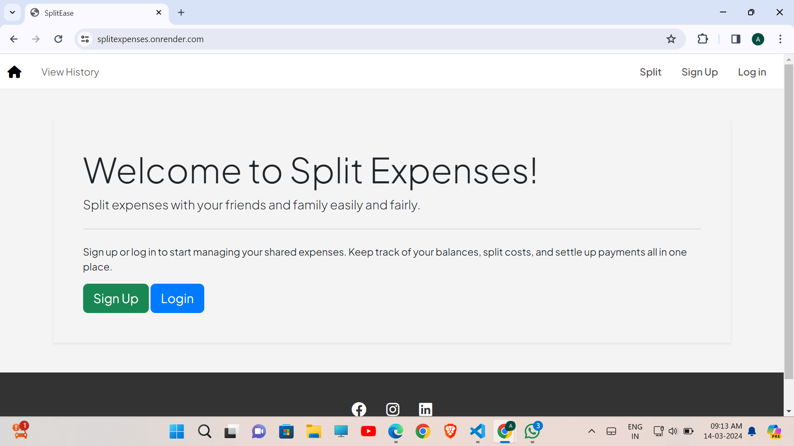

# SplitExpenses

SplitExpenses is a web application designed to simplify the process of splitting expenses among friends, family, or colleagues. Whether it's a shared meal, group travel, or household bills, SplitExpenses allows users to easily divide costs fairly and transparently.

## Live Demo

Check out the live demo of the application here: [SplitExpenses Live](https://splitexpenses.onrender.com/)

## Features

- User Authentication: Secure signup and login process.
- Expense Splitting: Easily create expenses, add participants, and split costs equally.
- Expense History: View a history of all your split expenses.
- Email Notifications: Participants receive an email detailing their share of each expense.
- Responsive Design: Optimized for both desktop and mobile devices.

## Getting Started

### Prerequisites

- Node.js
- MongoDB (for local development)
- A Gmail account (for sending email notifications)

### Installation

1. Clone the repository:
git clone https://github.com/AbhiSurve2412/SplitExpenses.git
cd SplitExpenses

2. Install dependencies:
npm install

3. Create a ".env" file in the root directory and add the following variables:

- For local development:
plaintext:
ATLASDB_URL=mongodb://127.0.0.1:27017/splitexpenses
APP_PASSWORD=YourGmailAppPassword

- For deployment, set `ATLASDB_URL` to your MongoDB Atlas URI and `APP_PASSWORD` to your Gmail App Password.

4. Start the application:
npm start

Navigate to `http://localhost:3000` to view the application.

## Deployment

This application is deployed on Render. Steps for deployment may vary based on your chosen platform.

## Usage

After logging in, users can create new expenses by specifying the details and adding participant emails. Each participant, including the creator, will receive an email with the expense details and their share.

## Snapshots

### Home Page

### Signup/Login Page

### Login Page

### Expense Creation Form

### Expense History View

### Mail Notification

## Built With

- [Node.js](https://nodejs.org/)
- [Express](https://expressjs.com/)
- [MongoDB](https://www.mongodb.com/)
- [Passport.js](http://www.passportjs.org/)
- [EJS](https://ejs.co/)
- [Bootstrap](https://getbootstrap.com/)
